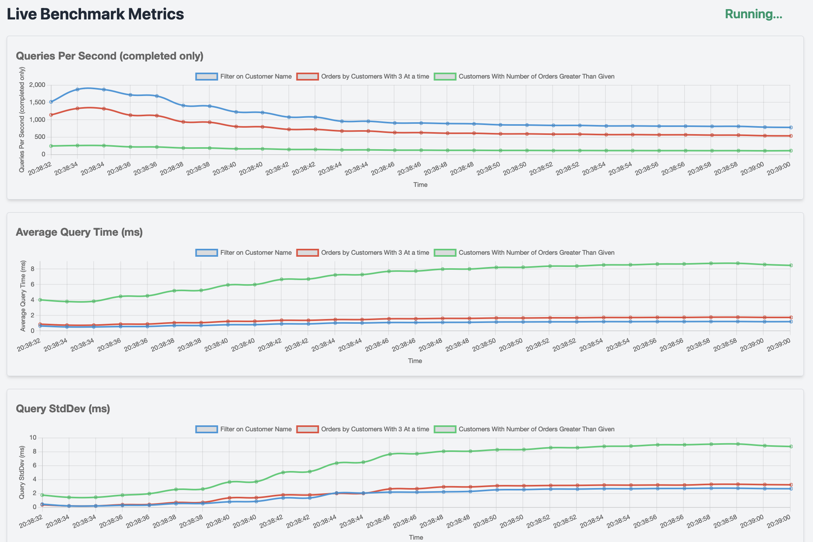

# 🌟 **db-stress-bench** 🌟
🚀 **Load Testing Made Simple for Databases**

🔥 **db-stress-bench** is a simple but powerful tool to **load test any database** with minimal configuration 🛠️

---


> Only 3 of 11 available realtime graphs are shown in this image.

## ✨ **Key Features**
### 1. **📊 Live Running Stats**
- Monitor real-time aggregate statistics directly in your browser.
- Available *live* in-browser aggregate stat graphs: 
  - Queries Per Second
  - Average Query Time (ms)
  - Query StdDev (ms)
  - Min Query Time (ms)
  - Max Query Time (ms)
  - Median Query Time (ms)
  - Successfully Completed Queries
  - Failed Queries
  - Invalid Input Payloads
  - Total Queries
  - Percentiles: 20th, 50th, 75th, 90th, 95th, 99th

### 2. **🖋️ Query Templates**
- Configure **multiple queries** to stress-test your database.
- Use **per-query csv file** to repace query template variables from the CSV dynamically at runtime, allowing you to thoroughly stress your database bypassing caching effects.
- Sample query: `select * from Customers where customer_name = '${customer_name}'`

### 3. **⚡ High Concurrency Support**
- Harness the power of **Java Virtual Threads** to run thousands of concurrent queries effortlessly (Even works/compiles on java-8+ if not using virtual threads (`useVirtualThreads: false`)).
- Gradually **ramp up concurrency** with configurable options for smooth stress testing.

### 4. **🗂️ Extensive Database Support**
- Out-of-the-box support for:
    - **MySQL** 🐬
    - **PostgreSQL** 🐘
    - **SQLite** 📦
    - **DuckDB** 🦆

### 5. **🧩 Easy Extensibility**
Add support for new databases by implementing a **simple 3-method interface**.

### 6. **📄 Logging**
Log **raw query results** to files for detailed analysis.

### 7. **🛠️ Ready-to-Run Samples**
You can start playing around immediately. This project already has:
- Sample **test queries**
- Sample **template data**
- Pre-configured **test databases** (SQLite and DuckDB)

Run with a **single command**:

```bash
java -jar target/db-stress-bench-1.0.1.jar
```  

No setup or configuration required! 🎉

Above one runs load tests against the provided duckdb database. To load test the provided sample **SQLite test database**, just update `activeDatabase` value to `com.freakynit.sql.db.stress.bench.db.sqlite.SqliteDatabaseInterface` and run again.

---

## 🚀 **Getting Started**
1. Clone this repository:
   ```bash
   git clone https://github.com/freakynit/db-stress-bench.git
   ```
2. Build the project:
   ```bash
   mvn clean package
   ```
3. Run with sample data:
   ```bash
   java -jar target/db-stress-bench-1.0.1.jar
   ```
4. Open your browser at **http://localhost:8080** to monitor live stats.
5. Check out `config.yaml` for all customizations.
6. Works/compiles on java-8+ (java-21+ if `useVirtualThreads` is true).

---

## 🌐 **Supported Databases**
| Database    | Status     |  
|-------------|------------|  
| MySQL       | ✅ Supported |  
| PostgreSQL  | ✅ Supported |  
| SQLite      | ✅ Supported |  
| DuckDB      | ✅ Supported |  


**Adding a new database?** Implement these 3 methods in the `DatabaseInterface` and you’re good to go! 🚀

---

## 📥 **Contributing**
We welcome contributions! 🤝
- **Report bugs** 🐛
- **Suggest features** ✨
- **Submit pull requests** 🚀

---

## 📜 **License**
This project is licensed under the [MIT License](LICENSE).

---

### 🌟 Star this repo if you find it useful! ⭐  
